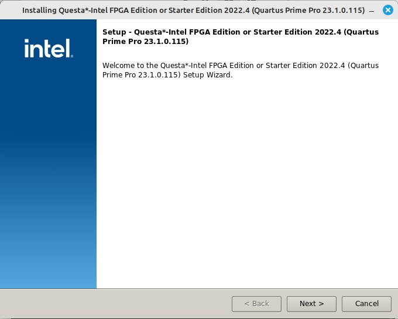
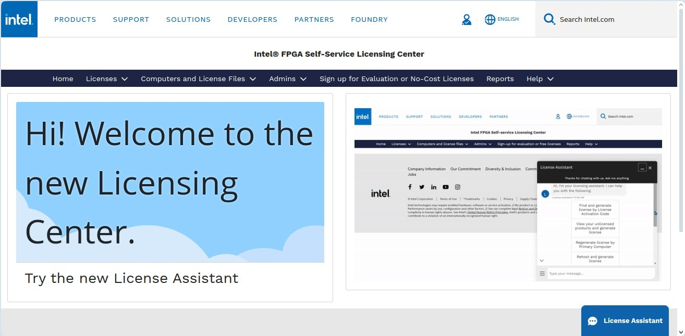

# Laboratorio 0: Instalación y Configuración de Framework para FPGA 
## Prueba básicas de funcionamiento del sumador de 1 bit

Las ***Field Programmable Gate Array (FPGA)*** son dispositivos reconfigurables, en los cuales se puede implementar cualquier lógica combinacional o secuencia, en general un amplio abanico de funciones electrónicas. Esto es gracias a que las FPGAS son dispositivos que integran bloques lógicos y que se pueden interconectar según la funcionalidad deseada escrita en Lenguaje de descripción de hardware (HDL).

Para obtener más información, se recomienda leer [FPGAs For Dummies eBook](https://www.stepfpga.com/doc/_media/fpgasfordummiesebook.pdf).

## Configuración del framework para FPGA

Para generar el bitstream, archivo que contiene la información de programación de la FPGA, los fabricantes de FPGAS (como Intel, Xilinx, Lattice, etc.) ofrencen las herramientas de desarrollo propias que facilitan la integración del sistema hardware con el HDL. Por ello, y acorde con la tecnología de trabajo se recomienda instalar las herramientas IDE y de sintetización, según gustos y tecnología. En este sentido el primer paso en este laboratorio es descargar las herramientas de diseño de hardware.

### Herramientas de Sintetización

* [ISEWebpack](https://github.com/Fabeltranm/SPARTAN6-ATMEGA-MAX5864/wiki/Instalaci%C3%B3n-y-Configuraci%C3%B3n#instalaci%C3%B3n-de-isewebpack) Descontinuado 
* [Vivado](https://www.xilinx.com/products/design-tools/vivado.html)  [guia](https://github.com/ELINGAP-7545/lab00/blob/master/laboo_vivado.md)
* [yosys](http://www.clifford.at/yosys/) Open
* [Quartus Prime lite](http://fpgasoftware.intel.com/?edition=lite) [guia](https://github.com/ELINGAP-7545/lab00#instalaci%C3%B3n-de-quartus-prime-lite) (recomendada para Digital 1)

### Instalar el IDE de su preferencia (si no desea utilizar los del fabricante)
* [Vim](https://www.vim.org/)
* [Atom](https://atom.io/)
* [Eclipse](https://www.eclipse.org) + [PyDev](https://www.pydev.org/)
* [Sublime Text](http://www.sublimetext.com)


## Tutorial para la IDE Quartus Prime lite

Esta guia está basada en el lab0 de intel [link](./docs//Intro_to_FPGA.pdf) 

### Descargar instalador
* Descargar los archivos de instalación de Quartus Prime lite del siguiente [link](http://fpgasoftware.intel.com/?edition=lite)
* Seleccione  la version 19.4 (o superior) y seleccione el sistema operativo respectivo.
* Descomprima  y ejecute el arcivo ***setup***. Siga las instrucciones de instalación de Quartus tools para su computador.

**NOTA**: Si no cuenta con usuario registrado en la página de Intel debe crear uno.

###  Instalación

En la terminal de linux:

 ```
chmod +x nombre_archivo.run
./nombre_archivo.run
```

###  Configuración de variables de entorno

En el archivo ```.bashrc```:

```
export ALTERAPATH="/home/user*/intelFPGA_lite/23.1std/"
export QUARTUS_ROOTDIR=${ALTERAPATH}/quartus
export QUARTUS_ROOTDIR_OVERRIDE="$QUARTUS_ROOTDIR"
export PATH=$PATH:${ALTERAPATH}/quartus/sopc_builder/bin
export PATH=$PATH:${ALTERAPATH}/nios2eds/bin
export PATH=$PATH:${QSYS_ROOTDIR}
```

donde ```user*``` corresponde a la cuenta de usuario del computador.

En la terminal:

```
sudo ln -s $QUARTUS_ROOTDIR/bin/quartus /bin/quartus
```

Ahora se podrá correr la IDE usando el comando ```quartus``` en la terminal.

## Tutorial para la herramienta de simulación Questa

### Descargar instalador

* Descargar los archivos Questa*-Intel® FPGA Edition (includes Starter Edition) del siguiente [link](https://www.intel.com/content/www/us/en/software-kit/776289/questa-intel-fpgas-pro-edition-software-version-23-1.html). Se debe descarga tanto el archivo con extensión ```.run``` como la parte II que tiene extensión ```.qdz``` en el mismo directorio.
* Tenga que la descarga de estos archivos tomará tiempo.
* Para el presente tutorial se descargó la versión 23.1.

###  Instalación

* En la terminal de linux:

 ```
    chmod +x nombre_archivo.run
    ./nombre_archivo.run
```

* Se abrirá el instalador (ver imagen).

     


    - Dar click en siguiente y seleccionar la opción ```Questa - Intel FPGA Starter Edition```.

    - Dar click en siguiente y aceptar los términos y condiciones.

    - Dar click en siguiente y seleccionar la carpeta de destino de la instalación.

    - Dar click en siguiente y revisar el resumen.

    - Dar click en siguiente con lo cual empezará la instalación 

### Descargar y configurar la licencia

Es necesario descargar la licencia de Questa para lo cual se debe:

* Ingresar al Self-Service Licensing Center de Intel en el siguiente [link](https://licensing.intel.com/psg/s/?language=en_US).

* Inscribirse en la opción [Enroll for Intel® FPGA Self Service Licensing
Center (SSLC)](https://www.intel.com/content/www/us/en/secure/forms/fpga-sslc-registration.html). 

* Loggerase en la opción [Already enrolled ? - Sign In here ](https://login.microsoftonline.com/46c98d88-e344-4ed4-8496-4ed7712e255d/oauth2/authorize?client_id=2793995e-0a7d-40d7-bd35-6968ba142197&redirect_uri=https%3A%2F%2Flauncher.myapps.microsoft.com%2Fapi%2Fsignin-oidc&response_type=code&scope=openid%20profile%20offline_access&code_challenge=l621EbMpMd8XCMUt32fOkdVx4LQ85OhcOiA9DS9mPMQ&code_challenge_method=S256&response_mode=form_post&nonce=638435098500409634.ZjJmMDY1YzYtZjM0OC00YmIxLWI4NWUtNTlkMmU0MGJjYzgxZmY1ZjkyNDgtOGIxOS00YmEyLTk1ZjctODIxOGQ1ZjYwMjA4&client_info=1&x-client-brkrver=IDWeb.2.13.2.0&state=CfDJ8E3NALe6oY1JvkTnnsQsCGyFKIDx-4SbDtmZoJPUlgmKjsHRPSR5otWRAPY5N420c27dON5pWiPUFCv8RYxYwnS4IEfWxDcSsGyPwd4qgm_yFUW2Oc6q80X7YhH4M6Qm0icDBQ4KM6MI5OzEtjYAfBNwkfCX42xjVa3wP9qfIrf5Pr9UpIKnh2Ao2bzxA05ltw07cQHfXxGVB4qWp75KPYLx1aplPrnEREmGZy_KRilW6ix08U5NCks8Y4ASbS2-LGUwR_HW6T163bZ8VvyPvFScu6rkH00tmrEEkvZ6EHNfnv9kpGW-CV_s2XG4xsm31sXMnamANcz5UcfPxQ3FW2k_y2X1tS7ckJu25ZbLLL98pTZ8rMueWU26653lNGb40l-6c1hmipyOPaWbfWtrfCq6IPKikdz_drSK3InXvBPoayBqA3UCZ-0bzxFzVDC1g3qFaycOLCFha2bAOn27QuT6xqexH-AZxmfCwnahlTfd3jJUCVaZ6Tvs17YtZT7R_CKJbsQr2BWkvql8oEUB7OI&x-client-SKU=ID_NET6_0&x-client-ver=6.35.0.0) (Intel Azure Portal). 
    - Se deben seguir todos los pasos, uno de ellos consiste en escanear un código QR, en caso de no ser posible usar la opción ```I want to set up a different methode```,  con la cual se enviará un código  como mensaje de texto al número de celular que se ingrese.

    - Leer y aceptar términos de uso.

* Una vez realizados los anteriores pasos, se abrirá el siguiente portal:

     

    - Ingresar a la opción ```Sing up for Evaluation or No-Cost License```.


    - Seleccionar la opción ```Questa*-Intel® FPGA Starter``` (ver imagen) y dar click en siguiente.

     

    - Se abrirá una interfaz para generar la licencia (ver imagen).

     

    - Dar click en ```+New Computer```.

    - Diligenciar los campos requeridos:
        - En  ```Primary NIC ID``` deben escribir el nombre de la cuenta de usuario de su pc.
        
        - En ```License type``` seleccionar FIXED.

        - En ```Computer type``` seleccionar NIC ID.

        - Para saber el  ```Primary Computer ID```:

            En una terminal de Linux escribir el comando ```ifconfig```.

            El NIC ID corresponde al número de la mac del driver de wifi o ethernet, para wifi aparecerá en la opción ```wlp1s0``` junto a la palabra ```ether```.

            Copiar todo el string que está separado por dos puntos ":", pero en la casilla ```Primary Computer ID``` borrarlos, es decir, sólo dejar caracteres alfanuméricos.

         - Dar click en ```save```, aceptar términos de uso y dar click en ```generar```.

    - Recibirán un correo con un archivo adjunto con extensión ```.dat```  correspondiente a la licencia.

    - Descargar la licencia en el directorio de instalación.

* Configurar la licencia en la IDE de Quartus:

    - En el menú ```Tools``` abrir el ```License setup```.

    - En la casilla ```License file``` cargar el archivo de la licencia ```.dat``` que acabaron de generar.

*  Configuración de variables de entorno de la licencia:

    En el archivo ```.bashrc```: 

    ```
    export LM_LICENSE_FILE=path_del_archivo/nombre_archivo.dat
    ```


  *  *  *  *  *

## Configuración básica para un nuevo proyecto en Quartus Prime lite

* Una vez instalado, debe abrir el programa ´Quartus´.
* En la barra de herramientas (toolbar) de Quartus, navegar en el menú ```File``` y hacer click en  ```New Project Wizard```. (ver imagen)

 

* ***Directory, Name, Top-Level Entity***,  seleccione el directorio donde se guarda el proyecto y el nombre del mismo. Tenga presente que debe colocar el nombre del módulo top en la tercera casilla, puede ser el mismo del proyecto. (ver imagen) 
    ***Recuerde:*** El nombre del módulo-top es sensible a mayúsculas.

 altera

* ***Project Type***, seleccione el template ```Empy project```.

* ***Add File***, si ya cuenta con los archivos fuentes de HDL adicione los ficheros respectivos. De igual manera, pueden agregar archivos fuentes más adelante.

*  ***Family, Device & Board Settings***,  Busque la tarjeta de desarrollo o la referencia de la FPGA  que se va a utilizar, ```10M50DAF484```, si considera necesario busque el nombre en la casilla  ```Name filter```, seleccione en el panel  Available devices el dispositivo usado. (ver imagen)

 


* ***EDA Tool Settings***,  espeficar la herramienta de simulación que se va a utilizar, se recomiendan  ```ModelSim``` (ver imagen) o ```Questa```. 

 

* ***Summary***, se debe revisar que la información de este panel esté acorde según la configuración realizada . (ver imagen)

 


# Entregables 

Tener configurado el framework según los pasos anteriores.

