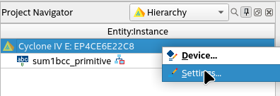
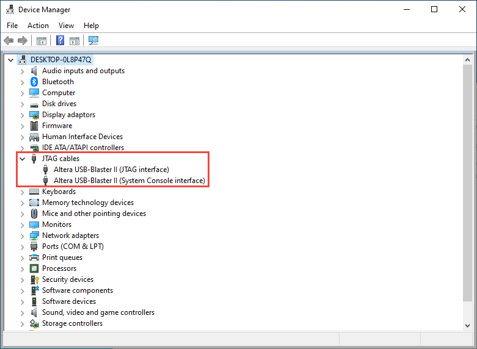
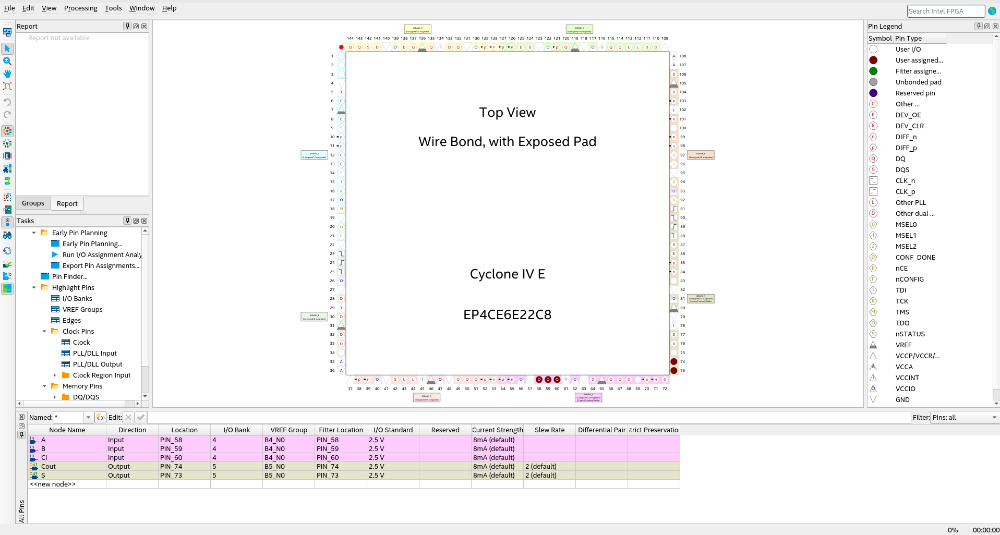

## Lab 01: Prueba básicas de Quartus con el Funcionamiento del sumador de 1 bit


En este paquete de trabajo los estudiantes deben familiarizarce con el framework de trabajo de la FPGA seleccionado, a partir de la descripción de un sumador de 1 y su simulación básica.


### 1 Especificación
Diseñar un sumador de un bit A y un bit B completo. Es decir el sumador cuenta con carrier  y se comporta acorde a la siguiente tabla de verdad.

A  | B  | Cin | Out | Cout 
-- | -- | --  | --  |  --
0| 0 | 0 |0 | 0
0| 0 | 1 | 1| 0
0| 1 | 0 | 1| 0
0| 1 | 1 | 0| 1
1| 0 | 0 | 1| 0
1| 0 | 1 | 0| 1
1| 1 | 0 | 0| 1
1| 1 | 1 | 1| 1

### 2 Bloque funcional

Según la especificación del sumador completo de 1 bit, se deduce que el bloque o modulo funcional esta dado por la siguiente gráfica: 


### 3 Lógica combinacional 

Optimizando el circuito, según la tabla de verdad, podemos observar que la lógica combinacional del ejercicio propuesto esta dada por:


 
### 4 Implementación HDL con Verilog


   ***Nota***: Verifique que tenga el programa para sintetizar la descripción de hardware, para este ejemplo, se usa [Quartus prime lite](https://github.com/ELINGAP-7545/lab00#configuraci%C3%B3n-b%C3%A1sica-para-un-nuevo-proyecto-en-quartus-prime-lite), si desea usar el framework de Xilinx  ir al  [link](https://github.com/Fabeltranm/SPARTAN6-ATMEGA-MAX5864/wiki/Introducci%C3%B3n).
 
#### a. HDL con bloques ***primitives***

Una vez abierto el  framework  de [Quartus prime lite](https://github.com/ELINGAP-7545/lab00#configuraci%C3%B3n-b%C3%A1sica-para-un-nuevo-proyecto-en-quartus-prime-lite), cree el nuevo proyecto como se explico en el laboratorio anterior con el wizard.

***Nota***: Recuerde se debe clonar el repositorio en su computador e importar el archivo **sum1bcc_primitive.v**.

Sin embargo si ***no*** importó el archivo **sum1bcc_primitive.v**,  realice el siguiente procedimiento: 

1. Navegar en el menú **File** y hacer clic en **New**. Selecionar **Verilog HDL File** según imagen:

 

2.  Digitar o copiar el siguiente código, pero antes recuerde que el HDL lo encuentra en la carpeta ```src```. 


```verilog

module sum1bcc_primitive (A, B, Ci,Cout,S);

  input  A;
  input  B;
  input  Ci;***
  output Cout;
  output S;

  wire a_ab;
  wire x_ab;
  wire cout_t;

  and(a_ab,A,B);
  xor(x_ab,A,B);

  xor(S,x_ab,Ci);
  and(cout_t,x_ab,Ci);

  or (Cout,cout_t,a_ab);

endmodule
```
Observe que el HDL inicia con la descripción del módulo ``` sum1bcc_primitive.v```: Se definen las  entradas  y salidas del bloque funcional, tal cual  como se estaba especificado en el bloque funcional.

Luego se instancia las respectivas puertas lógicas (AND, OR, XOR), acorde a los resultados de la lógica de la tabla de verdad. Se resalta la definición de tres componentes ```a_ab, x_ab, cout_t ```, de tipo ```wire ```, que no es más que 'cables' utilizados para conectar las salidas y entradas de unos módulos, en el actual ejemplo son conexiones de puertas. 


#### Entregables 1

* Comprenda cada línea del código HDL del archivo ```sum1bcc_primitive.v``` que se encuentra en la carpera ```src``` y comente si es necesario  en el archivo README.md

#### b. HDL con descripción de suma

Como vimos en el paso anterior, y su nombre lo indica, se está realizando una descripción funcional del módulo, en este sentido, podemos tener varios tipos de descripción, pero que cumplen con el mismo funcionamiento. A continuacíón se presenta otra descripción a partir del mismo sumador. 

En el archivo ``` sum1bcc.v```, que se encuentra en la carpeta ```src``` de su paquete de trabajo clonado, pueden observar la siguiente descripción:


```verilog
module sum1bcc (A, B, Ci,Cout,S);

  input  A;
  input  B;
  input  Ci;
  output Cout;
  output S;

  reg [1:0] st;

  assign S = st[0];
  assign Cout = st[1];

  always @ ( * ) begin
    st  <=   A+B+Ci;
  end
  
endmodule
```

Se evidencia que esta nueva descripción cuenta con un  ```reg```  de 2 bits ```st```. En este sentido, representa un elemento de almacenamiento de datos y conserva dicho valor hasta que se le asigna el siguiente valor.


#### Entregables 2

* Implemente un nuevo proyecto en quartus, pero donde el archivo top sea elmodule sum1bcc del archivo ``` sum1bcc.v```
* Comprenda cada línea del código HDL del archivo sum1bcc.v que se encuentra en la carpera src, si cree necesario realice los respectivos comentarios en el mismo archivo o el README.md
* Comente en el archivo README.md las diferencias entre las dos descripciones ```modulo sum1bcc``` y ```modulo sum1bcc_primitive```

### 5 Configuración del Proyecto en ***Quartus***

1. Una vez haya creado un nuevo proyecto, como se explicó en el lab00.md, aparecerá éste en la sección ```Project Navigator``` ---> ```Hierarchy```. 

2. Hacer click derecho en el nombre del proyecto dentro  de la lista **Entity_:Instance** y escoger la opción **Settings**.

      

3. En la ventana ```Settings```, escoger la opción  **Files**,  en la lista **Category**.

4. En el botón ```...``` seleccionar el archivo .v creado anteriormente (**sum1bcc.v** o **sum1bcc_primitive.v**). Hacer click en el botón ```Add```, para incluirlo en el proyecto.

      

5. Escoger la opción  **General**,  en la lista **Category**.

6. En la sección **Top-level entity** hacer click en el botón ```...```, lo que  desplegará un cuadro de diálogo, en donde se enlistaran los nombres de los módulos definidos en los archivos incluidos anteriormente. Seleccionar el módulo correspondiente. Este paso consiste en definir un módulo Top para el proyecto.

      

7. Finalmente podrá hacer doble click en la opción **Analysis & Synthesis**. 

      


### 6 Simulación funcional  en ***Quartus***

#### a. Configure el path del simulador en Quartus 

Para ejecutar el simulador de EDA (ModelSim o Questa) automáticamente desde el software *Quartus II* usando la función NativeLink, se debe especificar la ruta de  herramienta de simulación realizando los siguientes pasos:

   1. En el menú **Tools**, haga clic en **Options**. Aparece el cuadro de diálogo ```Options```.

   2. En la lista **Category**, en  **General**, seleccione **EDA Tool Options**. 

   3. En la opción ModelSim, se debe especificar la ubicación del ejecutable debería ser algo así como:
   
   ```
   /home/user*/intelFPGA_lite/20.1/modelsim_ase/linuxaloem
   ```

  ```
   /home/user*/intelFPGA_lite/23.1std/questa_fse/linux_x86_64
   ```

   donde ```user*``` es el nombre de la cuenta de usuario del computador.
   
   4. Si no es así, busque el directorio que contiene el ejecutable del simulador.

   5. Haga clic en **OK**.

#### b. ModelSim-Altera

Una vez configurado, estas listo para realizar las simulaciones del banco de pruebas (testBench), para ello:

1. Invocar ModelSim desde *Quartus*:  ```Tools``` --> **Run Simulation Tool** --> **RTL Simulation**.

2. En ModelSim, abra la vista de la **library**  si aún no está abierta (seleccionando **View** -->
**Library** y verifique que la libreria **work**, tenga el archivo **sum1bcc**.

3. En la pestaña **library**, seleccione **work** --> **sum1bcc**, que es el banco de pruebas. Haga doble click.

4. Deben cargarse dos ventanas de simulación: la ventana de **Objects** y la ventana de **wave**. Si no, cargarlas usted mismo haciendo click en el menú **view** y marcando la respectiva ventana.

5. Para mostrar todas las señales de prueba en la ventana Wave, teniendo como foco la ventana **Objects**, haga click en **add** --> **A Wave** -> **Signals in Region**.  Alternativamente, puede mostrar algunas señales seleccionadas en la ventana Wave: En la ventana  **Objects**, seleccione las señales que le gustaría monitorear y arrástrelas a la ventana ```Wave``` (o copiar y pegar).

6. configure las señales en sus estados y haga clic en **Run**.

####  Entregable 3
* Generar la simulación visual  y forzar la entradas ```A```, ```B``` y ```Ci``` a clock para  validar todas las posibles entradas.

* Analice la simulación de cada uno de los archivos y compruebe que el sumador funciona correctamente.

* Generar las gráficas respectivas y documente sus resultados en README.md.


# Anexos

## **Tutorial de implementación en la FPGA Cyclone IV**:

***Partes y conexiones***


### **Configuración del programador (USB-blaster) de la FPGA**:

### **1. Linux**:
----------------------------------------------------------------


***udev - Gestor Dinámico de Dispositivos Linux***: 

```udev``` es un sistema de espacio de usuario (se refiere a un espacio de aplicación, parcialmente en Unix o en sistemas operativos tipo Unix, el cual es externo al núcleo) que permite al administrador del sistema operativo registrar controladores de espacio de usuario para eventos. Estos eventos son generados principalmente por el kernel de Linux en respuesta a eventos físicos relacionados con dispositivos periféricos, en este caso el USB-blaster de la FPGA, permitiendo identificar dispositivos de forma dinámica en función de sus propiedades, como la ID del proveedor y la ID del dispositivo.

### **Cómo crear una regla ```udev``` para el USB-blaster de la FPGA**:

 * Existe una carpeta de reglas ```udev ``` en el directorio ```root```, para acceder a este se debe:

```
cd /
cd udev/rules.d/
```

 * Una vez en este directorio, con el comando ```sudo``` (porque estamos en un directorio ```root```) se debe crear un archivo con el nombre **51-usbblaster.rules** así:

```
sudo touch 51-usbblaster.rules
```

Con el comando anterior se creó un arhivo ```.rules``` vacío.

* Ahora se deben agregar las siguientes líneas dentro de ese archivo, para lo cual se puede hacer de dos formas:

  - Abrir en el directorio ```rules.d``` el editor de texto de preferencia, por ejemplo para VSC el comando ```code .``` abrirá el editor en dicha ubicación, en donde verá en la barra EXPLORER el archivo ```.rules``` creado junto a otros archivos y podrá editarlo agregando las siguientes líneas, pero, cuando lo intente guardar, VSC le solictará permiso para hacerlo como super usuario (sudo).

  - Con el comando ```sudo nano 51-usbblaster.rules``` abrirá el archivo creado anteriormente en la terminal y podrá agregar las siguientes lineas.

```
# Intel FPGA Download Cable

SUBSYSTEM=="usb", ATTR{idVendor}=="09fb", ATTR{idProduct}=="6001", MODE="0666"

SUBSYSTEM=="usb", ATTR{idVendor}=="09fb", ATTR{idProduct}=="6002", MODE="0666"

SUBSYSTEM=="usb", ATTR{idVendor}=="09fb", ATTR{idProduct}=="6003", MODE="0666"

# Intel FPGA Download Cable II

SUBSYSTEM=="usb", ATTR{idVendor}=="09fb", ATTR{idProduct}=="6010", MODE="0666"

SUBSYSTEM=="usb", ATTR{idVendor}=="09fb", ATTR{idProduct}=="6810", MODE="0666"

```

* Una vez creadas las reglas para el USB-blaster de la FPGA el siguiente comando actualizará dichas reglas en el sistema:

```
udevadm control --reload-rules
```

* Poterior a esto se debe hacer un *reboot* del computator.


### **2. Windows**:
----------------------------------------------------------------

1. Se debe conectar el USB-Blaster al computador.

2. Abrir el ```Device Manager```.

3. Bajo **Other devices** ---> **Unknown device** se encontrará el USB-blaster.

4. Click derecho sobre este dispositivo y seleccionar **Update driver**.


5. Seleccionar **Browse my computer for driver software**.

6. Buscar el driver en ```Path de la instalación de Quartus\quartus\drivers\usb-blaster-ii```.

7. Click en **Next**.

8. Seleccionar **Install** en la ventana **Would you like to install this device software?**

9. Al finalizar deberá aparecer una ventana confirmando la instalación exitosa del driver.

10. Finalmente, en el ```Device Manager``` ya no aparecerá el USB-blaster como un dispositivo desconocido (**Unknown device**).




(Tutorial para Windows tomado de [link](https://www.terasic.com.tw/wiki/Intel_USB_Blaster_II_Driver_Installation_Instructions))

### **Implementación del sumador de 1 bit**:
----------------------------------------------------------------

* Abrir el proyecto previamente creado para el sumador de 1 bit en *Quartus*.

* En la sección ```Project Navigator``` ---> ```Hierarchy``` hacer click derecho sobre el nombre del dispositivo como se muestra en la imagen y seleccionar la opción **Device**.


* Se abrirá la ventana ```Device``` en donde se debe seleccionar en **Family** la opción **Cyclone IV E** y en  **Available devices** seleccionar la referencia **EP4CE6E22C8** como se muestra en la imagen.


* Luego, en la sección ```Task``` se debe hacer click a la opción **Compile Design**.

* Posteriormente, en la barra **Standard** (que está debajo de la barra de menús), deben seleccionar el icono de **Pin Planer** que abrirá dicha ventana, donde se encontrará el pinout de la FPGA, como se muestra en las siguiente imagenes:





  - En la parte inferior de la ventana ```Pin Planer``` se puede observar una tabla con las entradas y salidas del diseño del sumador de 1 bit en la columna **Node name**.

  - En la columna **Location** se podrá seleccionar los pines de la FPGA asociados a ciertos elementos, en este caso, se van a usar switches para las entradas y leds para las salidas, dicha numeración se podrá observar directamente en la FPGA.

  - Posteriormente se debe dar doble click a la opción **Run I/O Assignment Analysis** que se encuentra en la sección ```Task```, en la parte izquierda de la ventana ```Pin Planer```.

* En la ventana principal de *Quartus*, se debe dar doble click en la opción **Program Device (Open Programmer)** que aparece en la sección ```Task```, que abrirá la ventana  ```Programmer``` como se muestra en la imagen.


* En la ventana  ```Programmer``` deben darle click al botón **Hardware Setup** que abrirá usa sub ventana en donde deben seleccionar el USB-blaster de la FPGA como se muestra en la imagen.


* Finalmente, en la ventana  ```Programmer``` deben darle click al botón **Start** que iniciará la programación de la FPGA, la cual pueden  observar en la barra de progreso (***No desconectar ni mover las conexiones a la FPGA mientras no vean la barra de progreso completada***) como se ve en la siguiente image.


* Con lo anterior se podrá interactuar con los tres switches seleccionados para cada una de las entradas del diseño y podrán corroborar el comportamiento del sumador de 1 bit con los leds.
